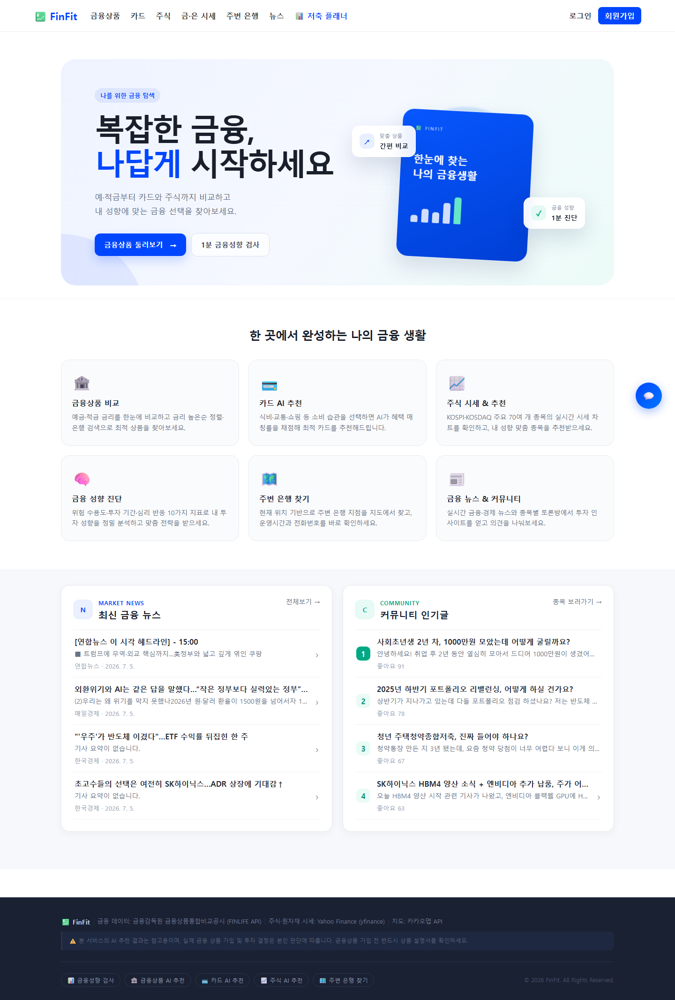
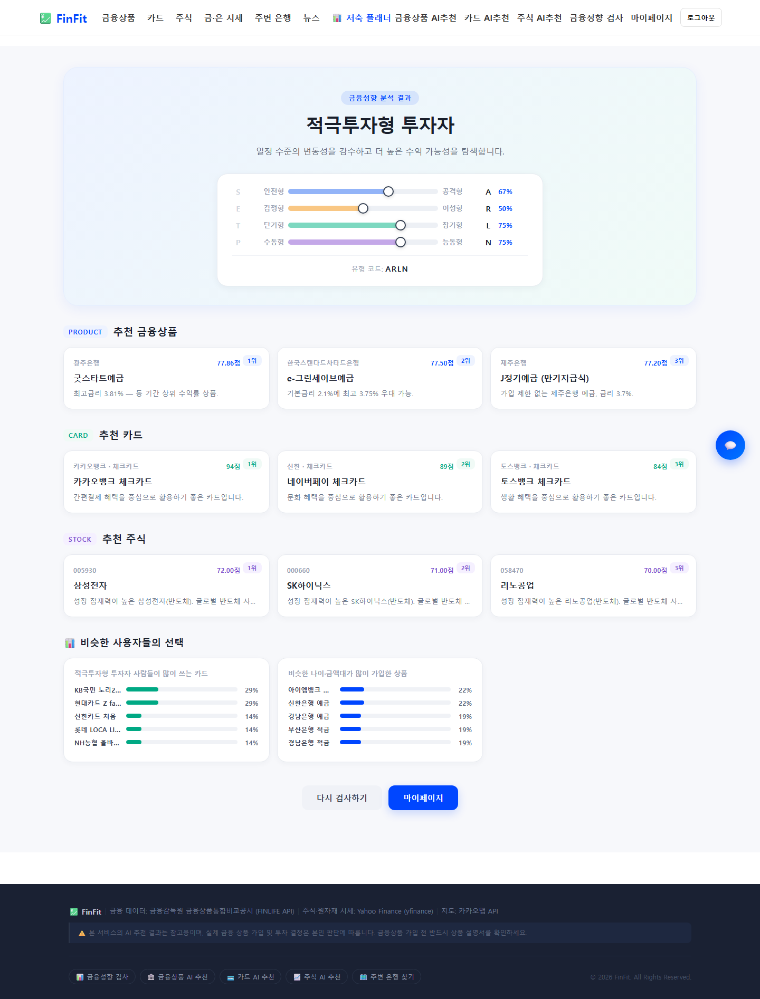
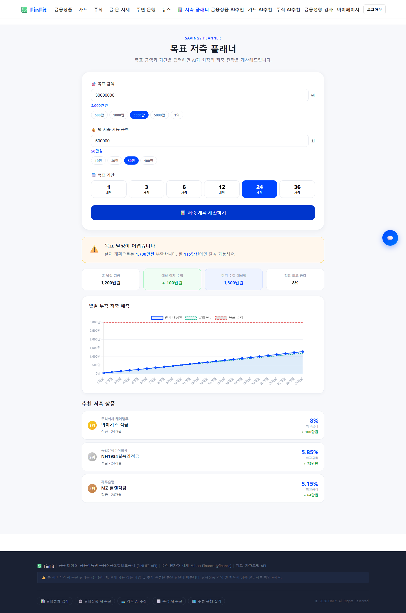
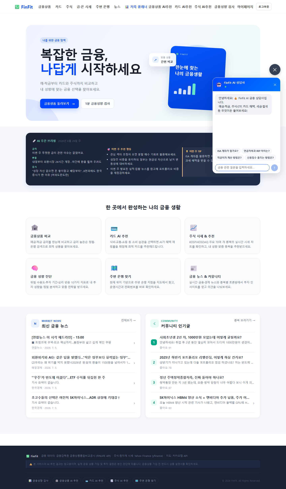

# FinFit — 사회초년생을 위한 금융성향 기반 추천 서비스

검색부터 시작하는 금융이 아니라, 자신의 금융성향을 먼저 파악하고 그에 맞는 상품을 추천받는 서비스입니다.

사회초년생에게 금융은 시작부터 막막합니다. 예·적금 상품만 수백 개고, 카드와 주식까지 고려하면 무엇이 나에게 맞는지 판단하기 어렵습니다. FinFit은 상품을 단순히 검색하게 하는 대신, 사용자의 금융성향을 먼저 분석하고 그 결과를 추천에 활용합니다.

10문항의 금융성향 검사로 사용자 성향을 4축 코드로 분석하고, 이를 기반으로 예·적금·주식·카드 상품을 AI가 추천합니다. 이 성향 코드는 추천뿐 아니라 유사 사용자 통계와 저축 플래너 필터링에도 쓰여, 한 번의 검사 결과가 서비스 여러 곳에서 사용자 맥락으로 재사용되도록 설계했습니다. 이 외에 목표 저축 플래너, AI 금융 상담, 주식·뉴스 기능을 함께 제공합니다.

<br>

## 프로젝트 개요

| 구분             | 내용                             |
| -------------- | ------------------------------ |
| 프로젝트           | FinFit                         |
| 기간             | 2026.05 ~ 2026.06              |
| 팀 구성           | 2인                             |
| 담당             | 백엔드 전체                         |
| Backend        | Django · Django REST Framework |
| Frontend       | Vue 3 · Pinia · Vite           |
| Database       | SQLite                         |
| AI             | SSAFY GMS · Gemini 1.5 Flash   |
| External API   | FSS FinLife · yfinance · RSS   |
| Authentication | JWT                            |

<br>

## 시연 화면

|                  홈 화면                 |             금융성향 검사 결과 & AI 추천            |
| :-----------------------------------: | :---------------------------------------: |
|  |  |

|               목표 저축 플래너              |                 AI 금융 상담 챗봇                 |
| :----------------------------------: | :-----------------------------------------: |
|  |  |

<br>

## 담당 업무

Django REST Framework를 기반으로 인증, 금융상품, 추천, 주식, 뉴스, AI 상담까지 백엔드 전체 API를 설계하고 구현했습니다.

* REST API 설계 및 구현
* JWT 기반 회원 인증 및 로그아웃 처리
* FSS FinLife API 연동 및 금융상품 데이터 수집
* 금융상품 검색·정렬·필터링·비교 API
* 금융성향 검사 및 4축 성향 코드 산출
* 금융성향 기반 예·적금·주식·카드 추천 로직
* AI 추천 및 추천 근거 생성
* GMS API 장애 대응을 위한 Gemini Fallback
* 주식 시세 및 뉴스 데이터 처리
* RSS 기반 AI 금융 주간 브리핑 자동화
* AI 금융 상담 API
* 주변 은행 및 원자재 시세 API
* 상품·카드 리뷰 및 커뮤니티 API

<br>

## 핵심 구현

이 프로젝트에서 가장 신경 쓴 부분은 금융성향 코드를 서비스 전반의 사용자 맥락으로 재사용한 것과, AI 추천에 서비스가 정의한 도메인 기준을 결합한 것입니다.

### 1. 금융성향 기반 AI 추천 시스템

LLM에게 상품 추천을 통째로 맡기는 대신, 서비스에서 직접 설계한 평가 기준과 사용자 성향을 추천 과정에 함께 반영했습니다.

```text
금융성향 검사
      ↓
4축 금융성향 코드 생성
      ↓
금융상품 데이터 조회
      ↓
상품 평가 기준 적용
      ↓
사용자 성향 + 상품 정보 기반 AI 추천
      ↓
추천 상품 + 추천 근거 제공
```

상품 평가 기준은 사회초년생이라는 타깃을 기준으로 다음과 같이 잡았습니다.

| 평가 기준          |  비중 |
| -------------- | :-: |
| 금리 경쟁력         | 40% |
| 수익 절대액         | 30% |
| 상품 유형 적합성      | 15% |
| 은행 신뢰도 및 인근 여부 | 15% |

금리를 가장 높게 둔 이유는, 자산이 적은 초기에는 상품 간 실수령액 차이가 크지 않아 조건이 비슷하면 결국 금리가 갈린다고 봤기 때문입니다. 다만 금리만 기준으로 두니 납입 한도나 기간이 짧아 실제 받는 돈은 적은 상품이 상위로 올라오는 경우가 있어, 수익 절대액을 별도 항목으로 뺐습니다. 나머지 두 항목은 성향 코드와의 적합성, 그리고 방문·상담을 선호하는 사용자를 위한 접근성을 보조 기준으로 넣은 것입니다.

가중치 자체가 정답은 아니고 타깃에 대한 가설을 수치로 옮긴 것에 가깝습니다. 중요하게 본 건 특정 숫자가 아니라, AI에 판단을 다 넘기지 않고 서비스가 기준을 정의해 프롬프트에 넣었다는 점입니다. 기준을 명확히 줬을 때 추천 결과가 더 일관됐고, 상품별 추천 근거도 함께 생성할 수 있었습니다.

이렇게 만든 성향 코드는 AI 추천 외에 유사 사용자 통계와 저축 플래너 상품 필터링에도 활용해, 검사를 일회성 테스트로 끝내지 않았습니다.

### 2. 금융성향 검사 설계

성향을 직접 질문만으로 판단하지 않고 상황 기반 질문과 역방향 문항을 섞어 구성했습니다. 모든 문항을 같은 방향으로 물으면 사용자가 문항을 제대로 안 읽고 한쪽으로만 답하는 편향이 생길 수 있어, Q2·Q6·Q9는 의미를 뒤집은 역방향 문항으로 두고 채점 시 점수를 보정했습니다.

```text
10문항 금융성향 검사
        ↓
응답 점수 계산
        ↓
역방향 문항 보정
        ↓
4개 축 성향 분석
        ↓
4자리 금융성향 코드 생성
```

**검증**
성향 코드 산출은 극단 응답 시나리오(모두 최고점 / 모두 최저점 / 역방향 문항만 반대로 응답)를 직접 넣어보며 4축 코드가 의도대로 나오는지 확인했습니다. 특히 역방향 문항을 보정 없이 계산하면 성향이 반대로 뒤집히는 걸 확인해, 보정 전후 결과를 비교했습니다.

### 3. 외부 금융 API 데이터 DB 캐싱

FSS FinLife API를 사용자 요청마다 직접 호출하는 방식은 응답 지연과 필터링 한계가 있었습니다. 실제 응답이 약 3~5초 걸려, 조회 요청마다 외부 API를 부르면 사용성이 떨어진다고 판단했습니다.

그래서 관리자 전용 수집 API로 상품 데이터를 DB에 저장해두고, 사용자 요청에서는 DB를 조회하도록 바꿨습니다. 외부 API의 느린 응답을 사용자 요청에서 분리하고, 검색·정렬·필터링은 ORM으로 처리했습니다.

```text
[수집] FSS FinLife API → 금융상품 데이터 → Django DB 저장
[조회] 사용자 → Django ORM → 검색·정렬·필터링·비교
```

| 구분 | 기존 (외부 API 직접 호출) | 개선 (DB 조회) |
| ------------- | :---------------: | :---------: |
| 상품 목록 응답 시간 |      약 3~5s       |   약 20~30ms   |
| 검색·정렬·필터링 |    API 제약으로 제한적    | ORM으로 자유롭게 처리 |

### 4. AI API 장애 대응 — GMS → Gemini Fallback

AI 기능이 외부 API에 의존하다 보니 특정 API 장애가 서비스 전체 오류로 이어질 수 있었습니다. 개발 중 실제로 GMS API가 응답하지 않는 상황을 겪어, Gemini 1.5 Flash를 Fallback으로 붙였습니다.

```text
사용자 요청
    ↓
GMS API
    ├── 정상 응답 → 결과 반환
    └── 응답 실패 → Gemini 1.5 Flash → 결과 반환
```

또 LLM이 JSON을 요구했는데도 Markdown 코드블록으로 감싸 반환하는 경우가 있어, 응답 전처리와 예외처리를 넣었습니다.

```text
LLM 응답 → Markdown 코드블록 제거 → JSON Parsing
   ├── 성공 → 결과 반환
   └── 실패 → 예외 처리
```

덕분에 외부 AI API의 일시적 장애나 예상치 못한 응답 형식이 서비스 전체 500 오류로 번지지 않게 했습니다.

### 5. JWT 인증 및 로그아웃 처리

JWT 인증을 구현하고 Access Token과 Refresh Token을 분리했습니다.

| Token         | 만료 시간 |
| ------------- | :---: |
| Access Token  |  2시간  |
| Refresh Token |   7일  |

처음에는 로그아웃 시 Frontend의 Token만 지웠는데, 이러면 서버에 이미 발급된 Token은 그대로 유효하다는 문제가 있었습니다. SimpleJWT의 Token Blacklist를 적용해 로그아웃 시 Refresh Token을 블랙리스트에 등록하고, 이후 재사용을 막았습니다.

```text
로그인 → Access + Refresh 발급 → (인증 요청) → 로그아웃
       → Refresh Token Blacklist 등록 → Refresh Token 재사용 차단
```

### 6. 금융 뉴스 자동 수집 및 AI 주간 브리핑

RSS로 금융 뉴스를 자동 수집하고 AI로 주간 브리핑을 생성합니다.

```text
금융 뉴스 RSS → 수집 → 정제 → AI 요약 → 주간 금융 브리핑
```

7개 RSS를 활용하며 매주 월요일 자동으로 브리핑이 생성됩니다. (주간 약 200건 수집·정제 후 요약)

자동 실행 과정에서 Django 개발 서버의 Auto Reload 때문에 Scheduler가 중복 실행되는 문제가 있었는데, 실행 프로세스를 구분해 중복 등록을 막았습니다.

<br>

## 주요 기능

**금융성향 검사 & AI 추천**
10문항 검사, 4축 성향 코드 산출, 역방향 문항 보정, 성향 기반 예·적금·주식·카드 추천, 상품별 추천 근거, 유사 사용자 통계

**금융상품**
FSS FinLife 기반 예·적금 조회, 검색, 금리·조건 정렬, 필터링, 상품 비교, 관심상품 등록, 상품 리뷰

**목표 저축 플래너**
목표 금액·기간 설정, 달성 가능 여부 계산, 미달 시 필요 월 납입액 계산, 필요 기간 역산, 조건 기반 상품 필터링

**주식 · 뉴스**
KOSPI/KOSDAQ 종목 조회, 시세·차트, 관심 종목 등록, 종목 관련 뉴스, 뉴스 한국어 번역

**AI 금융 서비스**
AI 금융 상담 챗봇(예·적금·주식·카드·세금), 비로그인 상담 지원, AI 주간 금융 브리핑

**기타**
주변 은행 검색·지도·경로 안내, 금·은 원자재 시세, 카드 리뷰, 커뮤니티 게시판

<br>

## 서비스 구조

```text
                    Vue 3
                      │
                  REST API
                      ↓
                Django / DRF
                      │
       ┌──────────────┼──────────────┐
       ↓              ↓              ↓
    SQLite         금융상품        주식/뉴스
       │           데이터 수집       데이터 수집
       │              ↓              ↓
       │         FinLife API    yfinance / RSS
       │
       └──────────────┐
                      ↓
                AI Recommendation
                      │
                ┌─────┴─────┐
                ↓           ↓
               GMS       Gemini
                         (Fallback)
```

<br>

## 기술 스택

**Frontend**


**Backend**


**AI · External API**

* SSAFY GMS — 금융상품 추천, 주식/카드 추천, 뉴스 번역, 금융 브리핑, AI 상담
* Gemini 1.5 Flash — GMS 장애 시 Fallback
* FSS FinLife API — 예·적금 상품 데이터
* yfinance — 국내 주식 시세 및 뉴스
* RSS — 금융 뉴스 자동 수집

<br>

## 트러블슈팅

| 문제                                  | 해결                              |
| ----------------------------------- | ------------------------------- |
| FSS FinLife API 응답 지연               | 상품 데이터를 DB에 저장하고 ORM으로 조회       |
| GMS API 응답 실패                       | Gemini 1.5 Flash Fallback       |
| LLM JSON 응답 형식 불일치                  | Markdown 제거 및 JSON Parsing 예외처리 |
| yfinance 응답 구조 변경                   | 변경된 응답 구조에 맞춰 데이터 처리 수정         |
| 외부 데이터 Timezone 불일치                 | timezone-aware datetime으로 정규화   |
| JWT 로그아웃 이후 Token 재사용               | Refresh Token Blacklist 적용      |
| Django Auto Reload로 Scheduler 중복 실행 | 실행 프로세스 구분으로 중복 방지              |

자세한 내용은 [트러블슈팅 문서](./docs/trouble-shooting.md)에 정리했습니다.

<br>

## 실행 방법

**1. 저장소 Clone**

```bash
git clone https://github.com/luster-woo/finance_pjt.git
cd finance_pjt
```

**2. Backend 실행**

```bash
pip install -r requirements.txt
cd BE
python manage.py migrate
python manage.py runserver
```

**3. Frontend 실행**

새 터미널을 열고:

```bash
cd FE
npm install
npm run dev
```

**4. 환경변수 설정**

루트 디렉토리의 `.env`에 다음 항목을 설정합니다. `.env.example`을 참고하면 됩니다.

```env
SECRET_KEY=
FINLIFE_API_KEY=
GMS_API_KEY=
GMS_API_URL=
GEMINI_API_KEY=
KAKAO_REST_API_KEY=
VITE_KAKAO_MAP_KEY=
```

**5. 금융상품 데이터 수집**

서버 실행 후 관리자 계정으로 아래 API를 호출하면 FSS FinLife API에서 상품 데이터를 수집합니다.

```text
/products/save-products/
/products/save-saving-products/
```

<br>

## 프로젝트 문서

| 문서                                  | 내용                               |
| ----------------------------------- | -------------------------------- |
| [설계서](./docs/설계서.md)                | 서비스 기획 의도·기능 설계·흐름도·DB 모델링       |
| [API 명세](./docs/api.md)             | 전체 API 엔드포인트 및 요청/응답 예시          |
| [기술 스택](./docs/tech-stack.md)       | 기술 선택 이유                         |
| [트러블슈팅](./docs/trouble-shooting.md) | 개발 과정에서 발생한 문제와 해결 과정            |

<br>

## 회고

**잘 된 부분**

가장 만족스러웠던 건 추천 시스템입니다. AI에게 "적합한 상품을 추천해줘"라고만 하는 대신 금리 40 · 수익 절대액 30 · 유형 적합성 15 · 은행 신뢰도 15라는 평가 기준을 직접 잡아 프롬프트에 넣었고, 기준을 명확히 줬을 때 추천이 더 일관됐고 근거도 함께 뽑을 수 있었습니다. AI에 판단을 다 맡기기보다 도메인 로직을 정의하고 AI를 그 안에 결합하는 쪽이 낫다는 걸 확인했습니다.

성향 검사를 단순 테스트로 끝내지 않고 4자리 코드로 만들어 AI 추천, 유사 사용자 통계, 저축 플래너 필터링에서 공통으로 쓴 것도 좋았습니다. 하나의 사용자 데이터를 여러 기능에서 같은 기준으로 활용하면서 기능 간 연결을 설계해볼 수 있었습니다.

외부 API를 여럿 쓰면서 장애와 응답 변경을 직접 겪은 것도 남는 경험입니다. GMS 장애에 Gemini Fallback을 붙이고 yfinance 응답 구조 변경에 대응하면서, 외부 서비스가 늘 정상 동작한다는 가정을 버리고 예외를 전제로 설계하게 됐습니다.

**아쉬운 부분**

배포까지 가지 못했습니다. SQLite는 로컬 포트폴리오 전제로 고른 것이었는데, 끝내고 보니 실제 서비스 URL을 못 준 게 가장 아쉽습니다. ORM을 쓰고 있어 PostgreSQL 전환은 큰 변경 없이 가능했던 만큼, 처음부터 배포를 염두에 뒀다면 실제 서비스까지 갈 수 있었을 것 같습니다.

주식 거래 기능은 종목 조회, 관심 종목, 시세 차트까지 했지만 모의 매수·매도까지는 기간 내에 못 붙였습니다. 거래 내역과 포트폴리오 수익률까지 연결했다면 완성도가 더 높았을 겁니다.

실시간 데이터에도 한계가 있었습니다. FinLife는 응답이 3~5초로 길어 DB 캐싱으로 돌렸고, yfinance는 비공식 라이브러리라 응답 구조가 바뀌는 문제를 겪었습니다. 외부 데이터는 신뢰성과 응답 속도까지 보고 골라야 하고, 데이터 수집과 사용자 요청을 분리하는 구조가 필요하다는 걸 체감했습니다.

<br>

## Team

| 이름   | 역할                            |
| ---- | ----------------------------- |
| 이윤우  | Backend 전체 · Django API 설계 및 구현 |
| 이진웅  | Frontend 전체 · Vue 3 UI/UX 구현   |

개발 기간: 2026.05 ~ 2026.06
