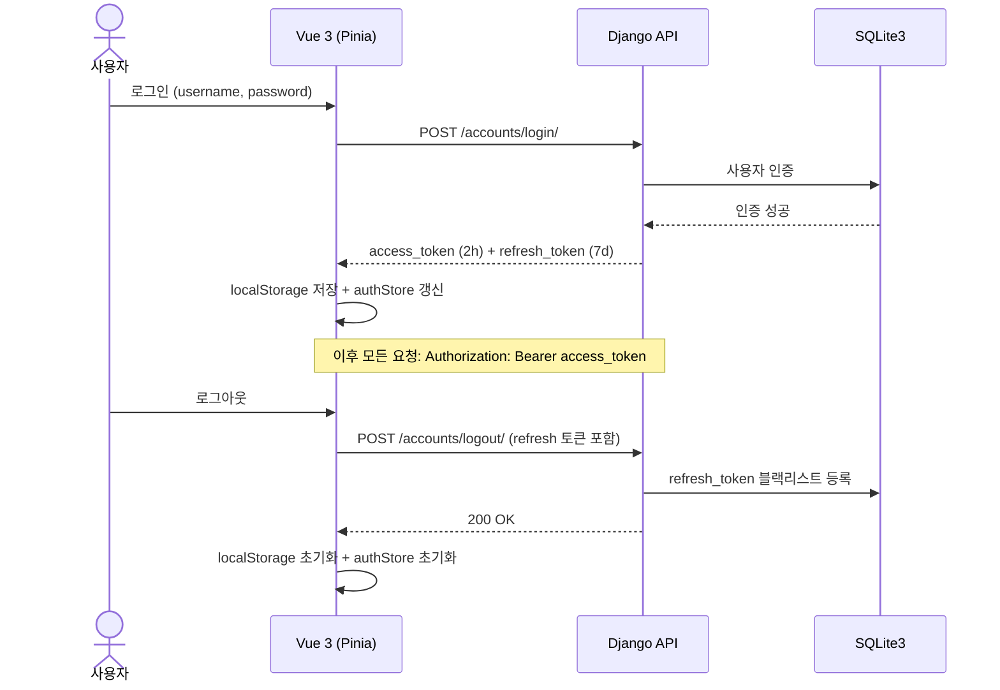
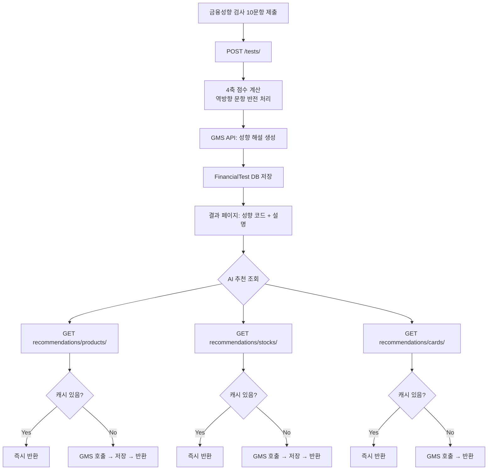
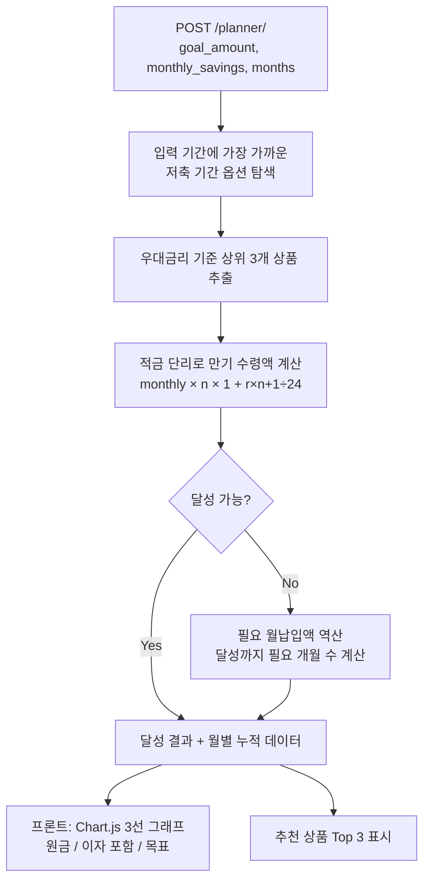
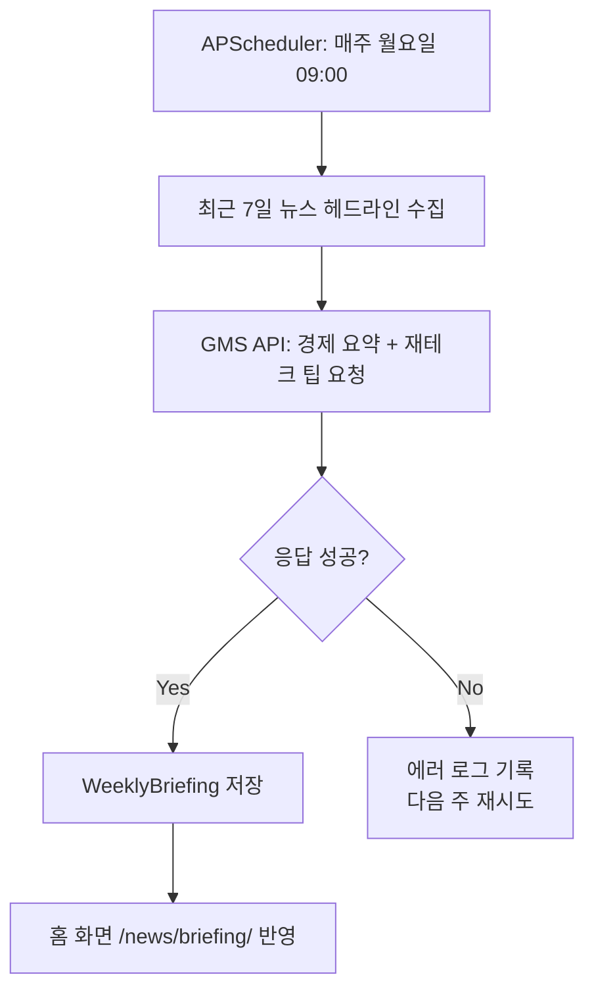
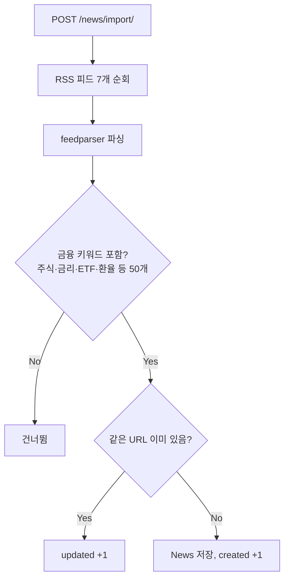
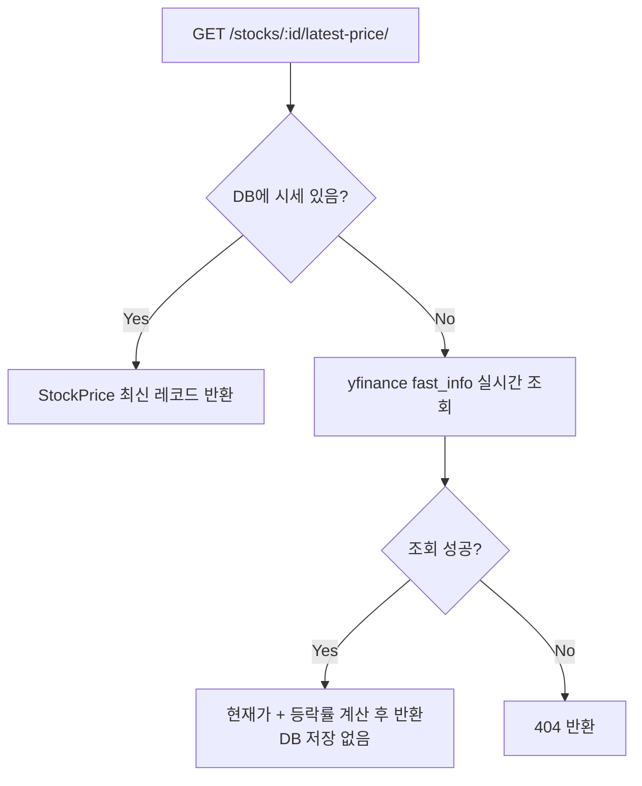

# FinFit 설계서

**팀원**: 이윤우 · 이진웅  
**개발 기간**: 2026.05 ~ 2026.06  
**스택**: Vue 3 + Django REST Framework + SQLite3

---

## 서비스 개요

FSS Finlife API를 처음 열어봤을 때, 예금 상품만 300개가 넘었습니다. 카드도 수십 개, 주식도 추가했더니 70종목. 이걸 그냥 목록으로 보여주면 사용자 입장에선 뭘 골라야 할지 알 수 없다는 게 분명했습니다.

그래서 서비스의 시작점을 "검색"이 아니라 "성향 파악"으로 잡았습니다. 10문항 금융성향 검사를 먼저 하고, 그 결과를 가지고 AI가 상품·주식·카드를 추천해주는 구조입니다. 검사 결과는 비슷한 성향 사용자 통계에도 쓰이고, 저축 플래너에서 적합 상품을 필터링할 때도 활용됩니다. 기능이 늘어날수록 검사 결과 하나가 전체 서비스에 맥락을 만들어줍니다.

기술 스택 선택 이유는 [tech-stack.md](./tech-stack.md)에 따로 정리했습니다.

---

## 시스템 구조

```
┌─────────────────────────────────────────────────────────────┐
│                    Frontend (Vue 3 + Vite)                  │
│  Pinia Auth Store ── Axios (JWT 인터셉터) ── Vue Router     │
└───────────────────────────┬─────────────────────────────────┘
                            │ HTTP / JSON
┌───────────────────────────▼─────────────────────────────────┐
│               Backend (Django 5 + DRF)                      │
│                                                             │
│  accounts  financial_tests  products  stocks  cards         │
│  banks     news             community reviews planner       │
│  favorites commodities      chat                            │
│                                                             │
│  APScheduler ── 월요일 09:00 뉴스 브리핑 자동 생성           │
└────┬──────────────────────────────────────┬─────────────────┘
     │                                      │
┌────▼────────────────────┐   ┌─────────────▼───────────────┐
│   External APIs         │   │         SQLite3             │
│  · FSS Finlife API      │   │  USE_TZ=True (Asia/Seoul)   │
│  · yfinance             │   │  JWT 블랙리스트 토큰         │
│  · SSAFY GMS API        │   └─────────────────────────────┘
│  · Kakao Maps/Mobility  │
└─────────────────────────┘
```

Django 앱을 12개로 나눈 건 처음부터 계획한 게 아니라 기능이 추가되면서 자연스럽게 분리된 결과입니다. `financial_tests`에 추천 로직을 다 몰아넣을 수도 있었지만, `products`·`stocks`·`cards` 각 앱이 자신의 모델만 알고 있으면 추천 쪽에서 가져다 쓰는 구조가 테스트하기 쉬웠습니다.

| 앱 | 담당 |
|----|------|
| accounts | 회원가입, 로그인, JWT, 마이페이지 |
| financial_tests | 성향 검사, AI 추천 3종, 유사 사용자 통계 |
| products | 예·적금 상품 목록, 검색, 비교, 계산기 |
| stocks | 주식 종목, yfinance 시세, 관심 종목 |
| cards | 카드 상품, 혜택, 리뷰 |
| banks | 카카오 지도 기반 주변 은행, 경로 안내 |
| news | RSS 자동 수집, AI 주간 브리핑 |
| commodities | 금·은 시세 (yfinance + 엑셀 업로드) |
| community | 종목 토론 게시판, 대댓글, 좋아요 |
| reviews | 상품·카드 리뷰, 좋아요/아쉬워요 반응 |
| favorites | 관심상품, 가입상품, 최근 본 상품 |
| planner | 목표 저축 플래너 |
| chat | AI 금융 상담 챗봇 |

---

## 금융성향 검사

10문항 MBTI 방식으로 4개 축의 성향을 측정합니다. 문항 설계 단계에서 고민이 좀 있었는데, 단순히 "공격적인 투자를 선호하시나요?" 같은 직접 질문 대신 상황 기반 질문으로 구성했습니다. 사람들이 자신의 실제 성향보다 이상적인 성향을 선택하는 경향이 있어서입니다.

Q2, Q6, Q9은 역방향 문항이라 `6 - 점수`로 반전 처리한 뒤 정규화합니다.

| 축 | 관련 문항 | 결과 |
|----|-----------|------|
| 위험 성향 | Q1(+) Q2(-) Q10(+) | S(안전형) / A(공격형) |
| 합리성 | Q5(+) Q6(-) Q9(-) | E(감정형) / R(이성형) |
| 투자 기간 | Q3(+) | T(단기형) / L(장기형) |
| 능동성 | Q4(+) Q7(+) Q8(+) | P(수동형) / N(능동형) |

종합 점수는 `정규화 합계 / (10 × 5) × 100`으로 계산하고, 0~100점 사이에서 5단계로 분류됩니다. 결과로 나오는 4자리 코드(예: ARLN, SETP)는 AI 추천 프롬프트에 그대로 포함됩니다.

---

## AI 추천 3종

### 금융상품 추천

성향 코드와 사용자의 거주 주소를 프롬프트에 포함해서 GMS에 요청합니다. AI가 채점할 때 사용하는 기준을 명시적으로 프롬프트에 써줬더니 결과 일관성이 훨씬 좋아졌습니다.

| 기준 | 비중 | 설명 |
|------|------|------|
| 금리 경쟁력 | 40% | 동일 기간 최고 우대금리 기준 |
| 수익 절대액 | 30% | 만기 예상 이자 금액 |
| 상품 유형 적합성 | 15% | 단기(6개월 이하) → 예금, 장기 → 적금 |
| 은행 신뢰도 + 인근 여부 | 15% | 시중은행 우선, 거주지 인근 가산점 |

추천 결과는 `AIProductRecommendation` 테이블에 캐싱합니다. 같은 검사 결과로 다시 들어오면 GMS를 다시 부르지 않고 바로 반환합니다.

### 카드 추천

성향 기반 추천과 별개로, 소비 습관 카테고리를 직접 선택해서 추천받는 방식입니다. 편의점·카페·대중교통처럼 카드 혜택 카테고리와 동일한 언어로 선택지를 구성했고, 선택한 항목과 각 카드 혜택의 매칭도를 기준으로 채점합니다. 연회비 대비 혜택 효율, 전월 실적 허들도 채점에 포함되는데 사회초년생 기준에선 실적 허들이 낮을수록 더 실용적이라 10%지만 방향성을 잡는 데 역할을 합니다.

### 주식 추천

안정형 성향이면 KOSPI 대형주(시총 상위, 배당 안정), 공격형이면 반도체·성장주 비중을 높이는 방향으로 프롬프트를 설계했습니다. 섹터 분산도 기준으로 넣어서 추천 5종목이 특정 업종에 쏠리지 않도록 유도했습니다.

---

## 저축 플래너

목표 금액, 월 저축액, 기간 세 가지를 입력하면 계산합니다. 적금 단리 공식 `월납입액 × n × (1 + r × (n+1) / 24)`으로 만기 수령액을 구하고, 목표에 못 미치면 두 가지를 역산합니다. 하나는 현재 기간 유지 시 필요한 월납입액, 다른 하나는 현재 월납입액으로 달성까지 걸리는 개월 수입니다. 사용자가 "저축을 더 늘릴 수 있는지" 아니면 "기간을 더 잡아야 하는지" 중 선택할 수 있게 하려는 의도입니다.

DB에 있는 상품 중 입력 기간에 가장 가까운 옵션을 가진 상위 3개를 함께 추천합니다. 최고 우대금리 기준으로 정렬하고, 이 금리가 계산의 기준값도 됩니다.

---

## AI 주간 브리핑 & 챗봇

**주간 브리핑**은 APScheduler로 매주 월요일 09:00에 자동 실행됩니다. 최근 7일치 뉴스 헤드라인을 묶어서 GMS에 보내면, 주간 경제 요약과 재테크 팁 두 가지를 돌려받아 `WeeklyBriefing` 테이블에 저장합니다.

**챗봇**은 GMS 시스템 프롬프트에 FinFit 금융 상담사 역할을 정의하고, 최근 6턴의 대화 내용을 컨텍스트로 포함해서 전달합니다. 토큰 절약 때문에 6턴으로 제한했는데, 금융 QA 용도에선 대부분 그 안에서 해결됩니다. 로그인 없이도 사용할 수 있고, 전 페이지 우하단 플로팅 버튼으로 접근합니다.

---

## 커뮤니티

종목별 토론 게시판입니다. 게시글을 특정 종목에 연결할 수도 있고, 종목 없이 일반 글로 올릴 수도 있어요. 댓글은 `Comment` 모델의 `parent` 필드가 자기 자신을 참조하는 self FK 구조로 대댓글을 지원합니다. 계층은 2단계(댓글·대댓글)까지만 허용하고, 조회할 때 최상위 댓글만 내려주고 대댓글은 `replies` 필드에 묶어서 반환합니다. 게시글과 댓글 각각 좋아요를 달 수 있고, 좋아요 수는 별도 집계 없이 `likes_count` 필드에 직접 관리합니다.

---

## 은행 지도

카카오 Maps SDK로 현재 위치 주변 은행 지점을 지도에 표시하고, 카카오 Mobility API로 선택한 지점까지의 경로와 소요 시간을 안내합니다. 국내 지점 데이터는 Google Maps보다 카카오가 더 정확하고, 대중교통 경로까지 함께 제공된다는 점에서 선택했어요. 다만 Kakao REST API 키와 JavaScript SDK 키가 별도로 필요해서 환경변수 설정이 조금 번거롭습니다.

---

## 원자재 시세

금·은 시세를 제공하는 기능입니다. yfinance로 실시간 데이터를 가져오는 방법과 엑셀 파일을 직접 업로드하는 방법 두 가지를 모두 지원합니다. 공식 데이터 소스에서 받은 엑셀을 올리면 DB에 일괄 적재되는 구조인데, yfinance가 간혹 시세를 못 가져오는 경우가 있어서 엑셀 업로드를 병행 방법으로 열어뒀습니다.

---

## 리뷰

금융상품과 카드 각각 리뷰를 작성할 수 있습니다. 별점과 텍스트 리뷰를 남기고, 다른 사용자 리뷰에 좋아요 또는 아쉬워요 반응을 달 수 있습니다. 반응은 `ReviewReaction` 모델로 분리해서 관리하고, 같은 리뷰에 반응을 중복으로 달 수 없습니다. 작성자 본인만 수정·삭제 가능하고, 권한 체크는 `403`으로 처리합니다.

---

## DB 모델링

```
User
├── FinancialTest ──┬── AIProductRecommendation
│                  └── AIStockRecommendation
├── Favorite           (관심 금융상품)
├── SubscribedProduct  (가입 금융상품)
├── RecentProduct      (최근 본 상품)
├── StockFavorite      (관심 주식)
├── Review             (금융상품 리뷰) ── ReviewReaction
├── CardReview         (카드 리뷰)
└── CommunityPost ──── Comment (parent FK로 대댓글 지원)

FinancialProduct ──── FinancialProductOption  (기간별 금리)
Stock            ──── StockPrice              (일별 시세)
Card             ──── CardBenefit             (혜택 목록)
News             ──── WeeklyBriefing          (AI 주간 요약)
```

전체 모델은 아래와 같습니다. ERD 이미지는 [erd.png](./erd.png)를 참고하세요.

| 모델 | 앱 | 주요 필드 |
|------|----|-----------|
| User | accounts | email, nickname, birth_date, financial_type, address, profile_image |
| FinancialTest | financial_tests | user, result_type, score, answers |
| AIProductRecommendation | financial_tests | user, test, product, score, reason |
| AIStockRecommendation | financial_tests | user, test, stock, score, reason |
| FinancialProduct | products | fin_prdt_cd, bank_name, product_type, special_condition |
| FinancialProductOption | products | product, save_trm, interest_rate, max_interest_rate |
| Stock | stocks | stock_code, stock_name, description |
| StockPrice | stocks | stock, price, change_rate, volume, recorded_at |
| StockFavorite | stocks | user, stock |
| Card | cards | card_name, company, card_type, annual_fee, min_performance |
| CardBenefit | cards | card, benefit_category, benefit_detail |
| CardReview | cards | user, card, rating, content |
| News | news | title, url, publisher, published_at |
| WeeklyBriefing | news | week_start, economy_summary, tip |
| CommunityPost | community | user, stock(nullable), title, content, likes_count |
| Comment | community | post, user, parent(self FK), likes_count |
| Review | reviews | user, product, rating, content |
| ReviewReaction | reviews | user, review, reaction_type |
| Favorite | favorites | user, product, created_at |
| SubscribedProduct | favorites | user, product, subscribed_at |
| RecentProduct | favorites | user, product, viewed_at |

---

## 주요 기능 흐름도

### 인증 흐름

로그아웃할 때 Refresh 토큰을 블랙리스트에 등록하는 부분이 핵심입니다. Access 토큰만 버리면 Refresh로 재발급이 가능해서, 진짜 무효화가 되려면 Refresh도 서버 측에서 막아야 합니다. `localStorage` 변경은 `auth-changed` 커스텀 이벤트로 Pinia에 반영해서 여러 탭이 열려 있어도 상태가 동기화됩니다.



---

### 금융성향 검사 → AI 추천

검사를 제출하면 점수 계산과 AI 해설 생성이 서버에서 이뤄지고, 결과는 DB에 저장됩니다. AI 추천 3종은 각각 독립적으로 캐싱되는데, 같은 검사 결과로 재조회할 때 GMS를 다시 부르지 않기 위해서입니다. GMS 응답이 느릴 때 사용자 경험에 영향을 주는 걸 줄이려고 선택한 구조입니다.



---

### 저축 플래너

플래너의 핵심은 달성 가능 여부만 알려주는 게 아니라, 달성 못 할 때 두 가지 방향을 동시에 제시하는 것입니다. 월납입액을 더 늘려야 하는지, 아니면 기간을 더 잡아야 하는지 — 사용자가 자신의 상황에 맞는 방향을 선택할 수 있게 했습니다.



---

### AI 주간 브리핑 자동 생성

APScheduler가 Django 프로세스 안에서 실행됩니다. 서버가 재시작되면 스케줄러도 같이 재시작되기 때문에, 서버 재시작 직후 타이밍에 따라 그 주 브리핑이 누락될 수 있습니다. 실제 서비스라면 외부 스케줄러를 쓰는 게 맞겠지만 포트폴리오 용도에선 이 정도로 충분합니다.



---

### 뉴스 수집

RSS 피드 7개(한국경제, 매일경제, 연합뉴스)를 순회합니다. 전체 뉴스가 아니라 경제·증권·재테크 섹션 URL만 사용했고, 금융 키워드 50개 중 하나라도 제목이나 요약에 포함되면 저장합니다. 일부 언론사가 기본 User-Agent로 오는 요청을 막아서 브라우저로 위장한 헤더를 써야 했습니다.



---

### 주식 시세 조회

DB에 저장된 시세가 있으면 바로 반환하고, 없을 때만 yfinance로 실시간 조회합니다. 실시간 조회 결과는 DB에 저장하지 않아서 다음 요청에서 또 yfinance를 호출하게 됩니다. 관리자가 `/stocks/import/prices/`로 시세를 먼저 수집해두면 이후 요청은 전부 DB에서 처리됩니다.



---

## 페이지 구성

| 경로 | 페이지 | 로그인 |
|------|--------|--------|
| / | 홈 (뉴스, 인기 게시글, AI 브리핑) | 불필요 |
| /login, /signup | 로그인, 회원가입 | 비로그인 전용 |
| /test | 금융성향 검사 | 필요 |
| /test/result | 검사 결과 + AI 추천 3종 | 필요 |
| /products | 금융상품 목록 | 불필요 |
| /products/recommend | 금액·기간 기반 AI 추천 | 필요 |
| /products/:id | 상품 상세, 리뷰 | 불필요 |
| /cards | 카드 목록 | 불필요 |
| /cards/recommend | 소비습관 기반 카드 추천 | 필요 |
| /cards/:id | 카드 상세, 리뷰 | 불필요 |
| /stocks | 주식 목록 (현재가, 등락률) | 불필요 |
| /stocks/recommend | 성향 기반 AI 주식 추천 | 필요 |
| /stocks/:id | 종목 상세 (차트, 뉴스, 토론방) | 불필요 |
| /commodities | 금·은 시세 차트 | 불필요 |
| /banks | 주변 은행 지도 + 경로 안내 | 불필요 |
| /news | 금융 뉴스 피드 | 불필요 |
| /planner | 목표 저축 플래너 | 필요 |
| /mypage | 마이페이지 | 필요 |

AI 챗봇 플로팅 버튼은 전 페이지에 표시되고, 비로그인 사용자도 이용할 수 있습니다.
